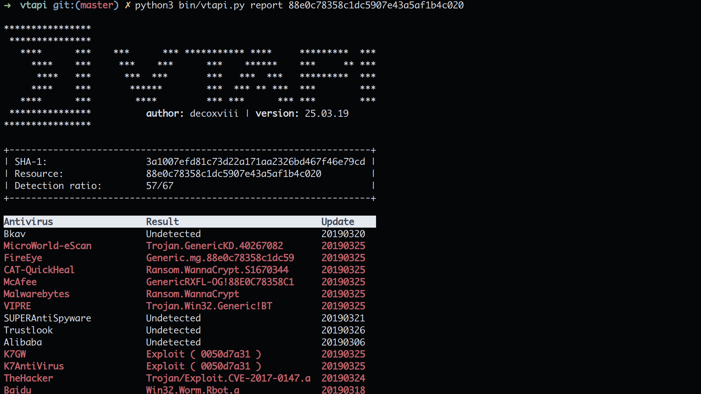

## VTAPI
Virus Total API


[](https://twitter.com/decoxviii)



### Install
```bash
# install dependencies (Debian/Ubuntu)
sudo apt install python3 python3-pip

# clone this repository
git clone https://github.com/decoxviii/vtapi.git; cd vtapi

# install python3 requirements
sudo -H pip3 install -r requirements.txt

# go to https://www.virustotal.com/gui/join-us
# get your Virus Total API key
# add your API key in: vtapi/apikey.py
vim vtapi/apikey.py
    apikey = 'here your apikey'

# view help
python3 bin/vtapi.py --help
```

### Test
1. Get file report (with md5):
```
python3 bin/vtapi.py report 88e0c78358c1dc5907e43a5af1b4c020 -o test-01
```

2. Get domain report:
```
python3 bin/vtapi.py report google.com --domain -o test-02
```

3. Scan a file:
```
python3 bin/vtapi.py scan sexy_girl.jpg.exe -o test-03
```

---

#### decoxviii

**[MIT](https://github.com/decoxviii/vtapi/blob/master/LICENSE)**
